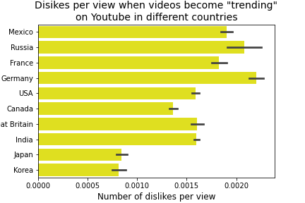
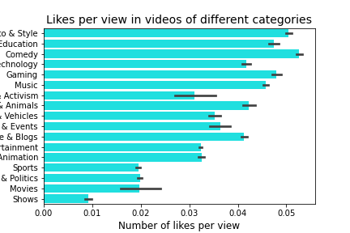
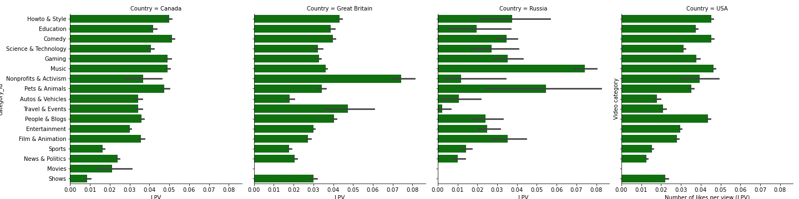
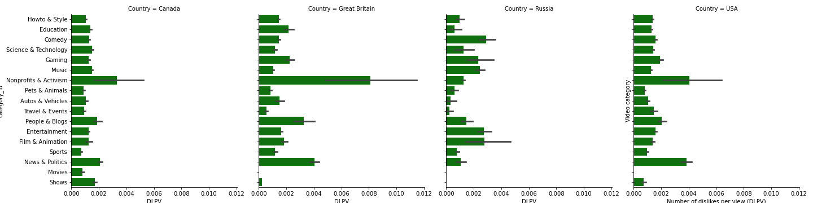

#**Youtube analytics - our path to internet fame**
---
## Durvan - Research question 1 - Does the yield of likes/dislikes per view on youtube differ between trending video categories across countries?

To answer this research question a new column (likes/view) was computed and used to make a bar plot with all of the countries in this analysis in the y axis:  

  
This figure shows that likes per view (LPV) when videos become trending can differ between countries. India,Japan and Korea have the lowest LPV, whereas Russia and Mexico have the highest. Actually, Russia and Mexico have a similar LPV, as seen by the length of the bars and similar standard error interval. Interestingly, the English-speaking countries (Canada, USA, Great Britain) have a similar LPV.

dislikes per view were computed and plotted too:  
  
In this graph it is striking how high the Russian dLPV is compared to the other countries. Howewer, this graph is on a different scale from the previous one, so dLPV values tend to be lower by an order of magnitude than LPV. Korea has the smallest dLPV in this dataset. both LPV and dLPV can vary with location, with no apparent conserved pattern between the figures.

In order to explore deeper, the LPV and dLPV for each categore were visualized, at first in all countries in the analysis overall:  
  
This figure shows that different categories of videos in this dataset can vary in the LPV too. 43 (Shows) ,30 (Movies) ,25 (News & Politics) , 17 (Sports) have the worst LPV, whereas 26 (HowTo & Style), 23 (Comedy), 27 (Education), 22 (People & Blogs), 20 (Gaming), 10 (Music), 29 (Nonprofits & Activism), 15 (Pets & Animals), 2(Education), have the highest LPVs.

To see what the pattern looked like for dLPV and if with highest LPVs would have lowest dLPVs, and vice-versa, a similar plot was made for dLPV per category.

  
This figure shows a different pattern compared to the LPV figure. The dLPV are smaller by ~order of magnitude, which is consistent with figure 2. Instead of a more evened out distribution such as seen on Figure 3, here category 29 stands out with dislikes per view much higher than the other categories, in all countries overall. Category 15 (Pets & Animals) has the lowest dislikes per view in this dataset (expected).

Similar bar plots were plotted for Canada, US, Russia and Great Britain, thus combining the analysis by category and by country.

**LPV per category in Canada, Great Britain, Russia, USA**  
  
This figure shows that Canada, Great Britain and USA show a similar pattern of distribution of bar heights across categories, where there are few bars that stand out higher than the mid-range. The LPV tends to be more evenly distributed throughout categories, though these categories can differ in LPV in different countries. Russia has more tall bars and a greater difference between the smallest and largest bars. Great Britain and Russia share a large similar LPV for 29 (Nonprofits & activism), which is in fact the highest LPV category for Great Britain in this dataset.  
The insight obtained from this is that LPV can differ both with country and with category, though Canada, USA, and Great Britain appear to show leff pronounced differences than those apparent between each one of them and Russia.

**dLPV per category in Canada, Great Britain, Russia, USA**  
  
This figure shows a few categories with much higher dislikes per view than the others. Still the size of these dLPV are much smaller than the LPV in Figure 4. Category 29 (Non profits and activist) is one of the highest or the highest dLPV category in this dataset in all of the 4 countries, and so it category 25. Interestingly, category 29 is also one of the highest in LPV in figure 4. 

From this analysis, a suitable answer to the research question would be that the yields of likes and dislikes per video in trending youtube videos do differ across categories and between countries. 

## Izgi - Research question 2 -

## Ammar - Research question 3 - 

